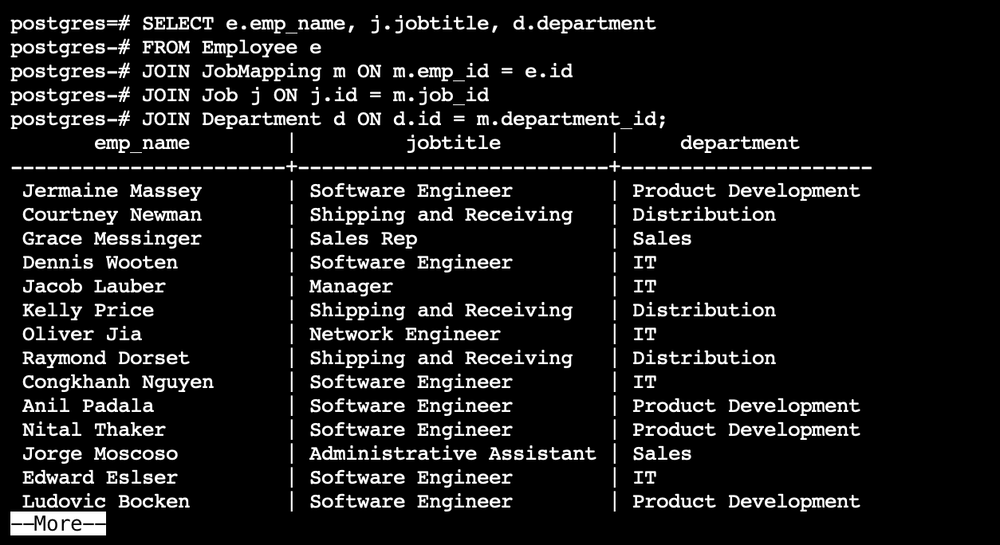
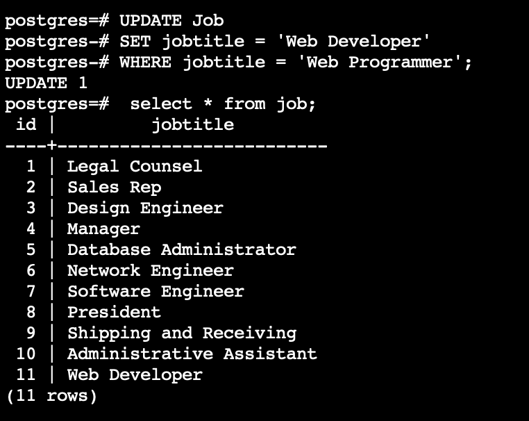

# Udacity Data Architect Nanodegree 

## Project 1 - Designing an HR Database

For this project, a database was designed, built, and populated for a Human Resources Department at the imaginary TECH ABC Corp. An HR manager, gave us a list of business requirements and the database was designed with best practices. 

## Business Requirement
Tech ABC Corp saw explosive growth with a sudden appearance onto the gaming scene with their new AI-powered video game console. As a result, they have gone from a small 10 person operation to 200 employees and 5 locations in under a year. HR is having trouble keeping up with the growth, since they are still maintaining employee information in a spreadsheet. While that worked for ten employees, it has becoming increasingly cumbersome to manage as the company expands.

As such, the HR department has tasked you, as the new data architect, to design and build a database capable of managing their employee information.

## ERD - Entity Relationship Diagrams

### Conceptual ERD

### Logical ERD

### Physical ERD

## CRUD

### Question 1 - Return a list of employees with Job Titles and Department Names

### Question 2 - Insert Web Programmer as a new job title

### Question 3 - Correct the job title from web programmer to web developer

### Question 4 - Delete the job title Web Developer from the database

### Question 5 - How many employees are in each department?

### Question 6 - Write a query that returns current and past jobs (include employee name, job title, department, manager name, start and end date for position) for employee Toni Lembeck.

## Files

[DDL SQL Commands](https://github.com/elok/Data-Architect-ND-HR-Database/blob/main/DDL_SQL_Commands.sql)

[DML SQL Commands](https://github.com/elok/Data-Architect-ND-HR-Database/blob/main/DML_SQL_Commands.sql)

[Crud SQL Commands](https://github.com/elok/Data-Architect-ND-HR-Database/blob/main/CRUD_SQL_Commands.sql)

[Proposal PDF](https://github.com/elok/Data-Architect-ND-HR-Database/blob/main/Proposal.pdf)

[HR dataset](https://github.com/elok/Data-Architect-ND-HR-Database/blob/main/hr-dataset.xlsx)
